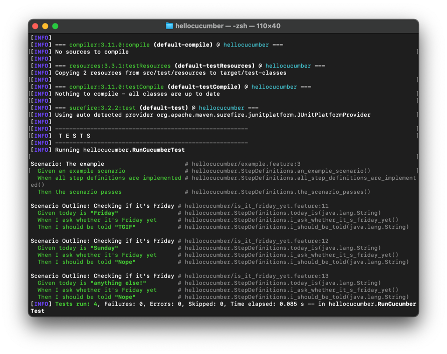
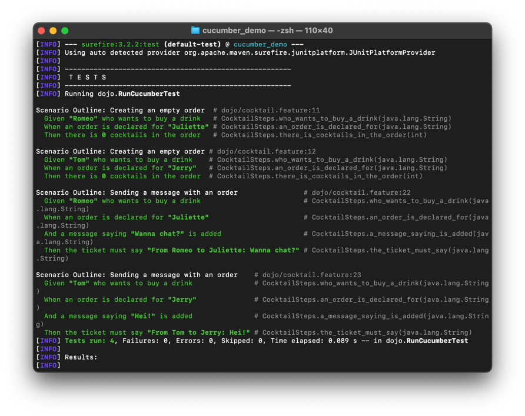

= R5.A.08 -- Dépôt pour les TPs
:icons: font
:MoSCoW: https://fr.wikipedia.org/wiki/M%C3%A9thode_MoSCoW[MoSCoW]

Ce dépôt concerne les rendus de mailto:A_changer@etu.univ-tlse2.fr[Jonh Doe].

== TP1

.Exemple de code
[source,java]
  ---
  @Given("today is Sunday")
  public void today_is_sunday() {
      // Write code here that turns the phrase above into concrete actions
      throw new io.cucumber.java.PendingException();
  }

  ---

[source,gherkin]
---
Feature: Is it Friday yet?
  Everybody wants to know when it's Friday

  Scenario Outline: Checking if it's Friday
    Given today is "<day>"
    When I ask whether it's Friday yet
    Then I should be told "<answer>"

    Examples:
      | day            | answer |
      | Friday         | TGIF   |
      | Sunday         | Nope   |
      | anything else! | Nope   |
---

Trace d'execution des tests

== TP2

Contenu de order.java

[source,java]
  ---
  package classes;

  import java.util.ArrayList;
  import java.util.List;

  public class Order {

      private String owner;
      private String target;
      private String message;
      private final List<String> cocktails;

      public Order() {
          this.cocktails = new ArrayList<>();
      }

      public void declareOwner(String owner) {
          this.owner = owner;
      }

      public void declareTarget(String target) {
          this.target = target;
      }

      public void setMessage(String message) {
          this.message = message;
      }

      public String getTicket() {
          return String.format("From %s to %s: %s", owner, target, message);
      }

      public List<String> getCocktails() {
          return this.cocktails;
      }

      public void addCocktail(String s) {
          this.cocktails.add(s);
      }
  }
  ---

Trace d'execution des tests

